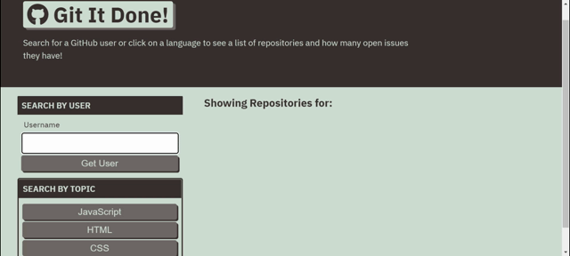

# git-it-done

Carleton Coding Bootcamp: Week 6 walkthrough project

## Main Objective

Working with server-side APIs, fetch requests and endpoint to create an application that will allow you to search through GitHub to find repos with open issues. Users should be able to search by username or by coding language.

## Deployed Application
https://gitjanaew.github.io/git-it-done/
